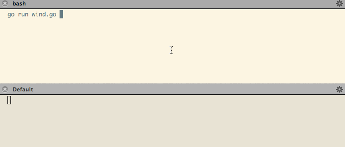

# Chronicler - A Storytelling Web Toolkit. 

Chronicler is a toolkit for web request routing in Go, it's very heavily influenced by [Cuba](http://cuba.is/), a fantastic web microframework for Ruby. The bulk of Go and Ruby web frameworks are heavily influenced by [Rails](https://github.com/rails/rails) or [Sinatra](https://github.com/sinatra/sinatra) when it comes to request routing: their routing is based in evaluating the http request verb and/or path, **what sets Chronicle and Cuba apart is the notion of requests evaluating arbitrary conditions and code to create the routing tree**. This is a very powerful idea.

You can read more about this in the article [Much Ado About Traversal](http://pyramid.readthedocs.org/en/latest/narr/muchadoabouttraversal.html) that discusses similar concepts and how they apply to Python's [Pyramid](http://pyramid.readthedocs.org/en/latest/) framework.

This project started with the intention of being a simple port of Cuba but the differences in the languages they are implemented in forced me to adapt Cuba's ideas to a more idiomatic approach, Chronicler is the result of that effort.

**DISCLAIMER**: This is right now at a "proof of concept" stage, although I plan to start using it and move towards making a stable release. Please do open issues or ping me in irc for feedback, I hang out at #lesscode in freenode :).


## GoDoc

You can look at [Chronicler's GoDoc page](https://godoc.org/github.com/pote/chronicler) for more documentation.

## The Basics

The concept behind Chronicler is quite simple: your application will be composed of **stories** and **routes**, stories group together routes which in turn  represent both a set of matching conditions and the code to be executed if these conditions are met.

A very basic Chronicler application will look like this:

```go
package main

import(
  "github.com/pote/chronicler"
  "io"
  "net/http"
)

func main() {
  saga := chronicler.NewStory()
  saga.Register(&home{})

  saga.Serve(":8080")
}

type home struct { }
func (r *home) Match(req *http.Request) bool {
  return true
}
func (r *home) Perform(w http.ResponseWriter, req *http.Request) {
  io.WriteString(w, "It was night again. The Waystone Inn lay in silence, and it was a silence of three parts.\n")
}
```


By the way, the references are from [The Name of the Wind](http://www.amazon.com/Name-Wind-Kingkiller-Chronicle-Day-ebook/dp/B0010SKUYM/ref=sr_1_1?ie=UTF8&qid=1413554542&sr=8-1&keywords=The+Name+of+the+Wind), you should read it if you like fantasy. :)

## Stories

Stories are one of the two building blocks of Chronicler applications, in practice they are little more than a collection of Routes and some convenience methods to glue your application together, if I didn't think that life is too short to always code using boring and intuitive naming I probably would have called them Nodes.

### `story.Register(*Route)`

The `Register` method adds a route to the route stack of a given Story.

It's important to note that the order of registration is highly relevant: whenever a route is matched Chronicler will take that path through the code and Routes that come after the matched one will not even be evaluated. This means that it's recommended to register more explicit Routes first and leave the more generic ones last.

### `story.Explore(http.ResponseWriter, *http.Request)`

The `Explore` method will look for matching routes in the stack and run the `Perform` method in the first route that matches.

### `story.Serve(string)`

`Serve` is called on the main story where all requests are routed, in Chronicler's jargon we call this story the **saga**, but you don't really need to remember that. :)

## Routes

Routes are what makes your application tick: they will take your request further into your stack and/or execute code, sometimes modifying the original request before passing it along.

Routes are interfaces and as such they can be anything you want as long as they implement the following methods:

### `route.Match(*http.Request) bool`

The Match method will determine if your route will respond to a specific request, this is a regular method and can run arbitrary code in order to make this disctintion ranging from evaluating the Request path and HTTP verb to checking the time of the day or reacting differently depending on header values or authentication status, anything and everything that you can imagine.

### `route.Perform(http.ResponseWriter, *http.Request)`

The Perform method (we'll just call them Performances) is the code that will be executed when the Route is matched, this is arbitrary code and can fullfill one or more of several roles:

#### Routing Performances

Routing Performances take you to other places in your code, this is done by creating a new sub-story with it's own sets of Routes and delegating the requests to the sub-story. Nesting Routes makes it really easy to compose your application and routing tree by assigning one responsibility to each Performance.

This Performance routes requests on a food delivery web app, we'll hit it with a GET /orders HTTP request.

```go
func (r *home) Perform(w http.ResponseWriter, req *http.Request) {
  story := chronicler.NewStory()
  story.Register(&sessions{})    // This Route will not be matched by GET /orders
  story.Register(&orders{})      // but this one will.
  story.Register(&restaurants{}) // This one won't even be evaluated.

  story.Explore(w, req)
}

type sessions struct { }
func (r *sessions) Match(req *http.Request) bool {
  return req.Headers.Get("Authorization") == "secret token"
}
func (r *sessions) Perform(w http.ResponseWriter, req *http.Request) {
  // No Op
}

type orders struct { }
func (r *orders) currentUser(req *http.Request) *User {
  token := req.Header.Get("Authorization")
  user := // get your user through your ORM of choice. :)
  return user
}
func (r *orders) Match(req *http.Request) (bool) {
  return strings.HasPrefix(req.URL.Path, "/orders")
}
func (r *orders) Perform(w http.ResponseWriter, req *http.Request) {
  story := chronicler.NewStory()
  story.Register(&newOrder{})
  story.Register(&orderIndex{})

  story.Explore(w, req)
}
```

The starting poing of this flow is a Routing Performance that registers several possible routes, our GET /orders HTTP request will be evaluated against orders.Match successfully, and so orders.Perform will be called, starting another Match cycle.


#### Transforming Performances

Transformations are changes that any given Performance can apply to the request it receives, different parts of your application will benefit from working under a given set of circumstances which you can refine as the requests moves through the Routes in your application.

Transformations are similar to the concept of a [middleware stack](http://en.wikipedia.org/wiki/Middleware) except they are naturally scoped to a given Route - and by extension to all routes nested within it.


```go
func (r *userOrders) Perform(w http.ResponseWriter, req *http.Request) {
  story := chronicler.NewStory()
  story.Register(&orders{})

  // There's a helper for this, but we'll talk about that later. :)
  req.URL.Path = strings.TrimPrefix(req.URL.Path, "/user")

  story.Explore(w, req)
}
```

This is a common transformation of a request as you usually want the inner routes o not have to deal with parts of the URL that have already been matched. This is however only a tiny example of transformations: you are free to run arbitrary code in your Performances so anything is game here. Transformations are commonly used in Routing Performances.

#### Conclusions

Conclusions are Performances that don't propagate the request to any other routes, they're the final destination for the request in the matched routing tree. They tipically represent a specific flow in your application such as "creating a user and return it as json".

```go
func (r *ending) Perform(w http.ResponseWriter, req *http.Request) {
  io.WriteString(w, "And they lived happily ever after.")
}
```
